### Тест 1: SIGINT

| Параметр | Значение |
|----------|----------|
| **Команда** | `kill -SIGINT <PID>` |
| **Ожидаемый результат** | Запись в файл о получении SIGINT. После 3 SIGINT - программа завершается. |
| **Фактический результат** | Программа завершилась после 3 SIGINT. |

**Скриншоты:**  
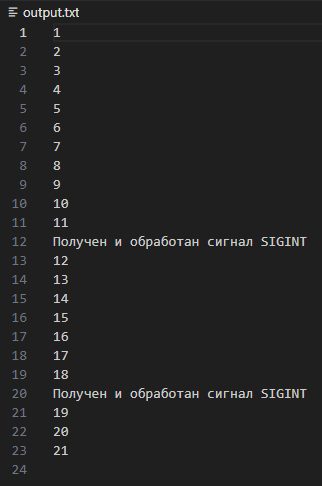

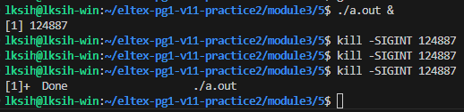

---

### Тест 2: SIGQUIT

| Параметр | Значение |
|----------|----------|
| **Команда** | `kill -SIGQUIT <PID>` |
| **Ожидаемый результат** | Запись в файл о получении SIGQUIT. Программа продолжает работу даже после 3 сигналов. |
| **Фактический результат** | Запись в файле появилась, программа продолжила работу. |

**Скриншот:**  
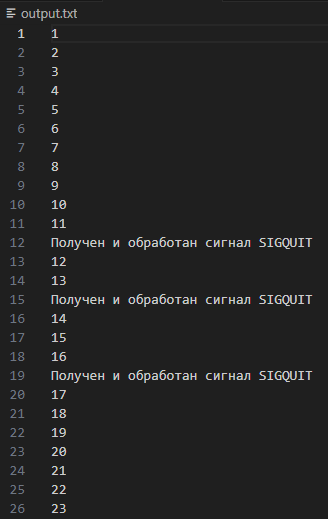

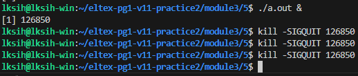

---

### Тест 3: SIGABRT

| Параметр | Значение |
|----------|----------|
| **Команда** | `kill -SIGABRT <PID>` |
| **Ожидаемый результат** | Программа завершается сразу же после первого сигнала. Записей в файле о сигнале не будет. |
| **Фактический результат** | Программа завершилась сразу же без записей о сигнале в файле. |

**Скриншот:**  
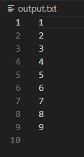

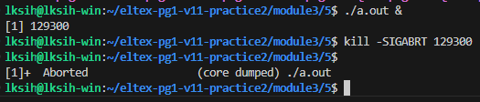

---

### Тест 4: SIGKILL

| Параметр | Значение |
|----------|----------|
| **Команда** | `kill -SIGKILL <PID>` |
| **Ожидаемый результат** | Программа завершается сразу же после первого сигнала. Записей в файле о сигнале не будет. |
| **Фактический результат** | Программа завершилась сразу же без записей о сигнале в файле. |

**Скриншот:**  
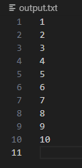

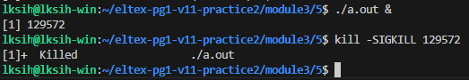

---

### Тест 5: SIGTERM

| Параметр | Значение |
|----------|----------|
| **Команда** | `kill -SIGTERM <PID>` |
| **Ожидаемый результат** | Программа завершается сразу же после первого сигнала. Записей в файле о сигнале не будет. |
| **Фактический результат** | Программа завершилась сразу же без записей о сигнале в файле. |

**Скриншот:**  
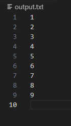

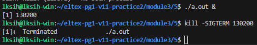

---

### Тест 6: SIGTSTP

| Параметр | Значение |
|----------|----------|
| **Команда** | `kill -SIGTSTP <PID>` |
| **Ожидаемый результат** | Процесс приостановлен и перестаёт писать в файл. Записей в файле о сигнале не будет. |
| **Фактический результат** | Процесс остановился без записей о сигнале. |

**Скриншот:**  
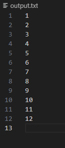

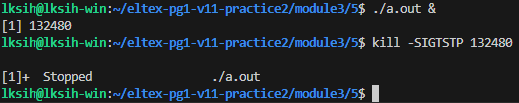

---

### Тест 7: SIGSTOP

| Параметр | Значение |
|----------|----------|
| **Команда** | `kill -SIGSTOP <PID>` |
| **Ожидаемый результат** | Процесс приостановлен и перестаёт писать в файл. Записей в файле о сигнале не будет. |
| **Фактический результат** | Процесс остановился без записей о сигнале. |

**Скриншот:**  
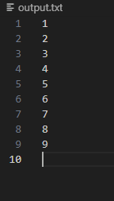

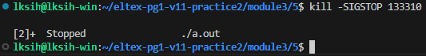

---

### Тест 8: SIGCONT (продолжение после SIGTSTP)

| Параметр | Значение |
|----------|----------|
| **Команда** | `kill -SIGCONT <PID>` |
| **Ожидаемый результат** | Процесс продолжает запись в файл. Сообщений о сигнале в файле не появляется. |
| **Фактический результат** | Процесс продолжил писать в файл без сообщений о сигнале. |

**Скриншот:**  
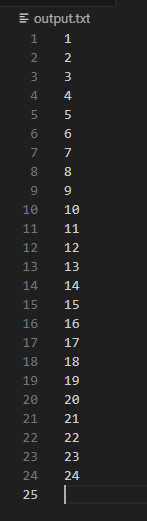

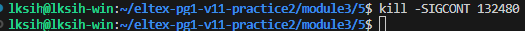

---

### Тест 9: SIGCONT (продолжение после SIGSTOP)

| Параметр | Значение |
|----------|----------|
| **Команда** | `kill -SIGCONT <PID>` |
| **Ожидаемый результат** | Процесс продолжает запись в файл. Сообщений о сигнале в файле не появляется. |
| **Фактический результат** | Процесс продолжил писать в файл без сообщений о сигнале. |

**Скриншот:**  
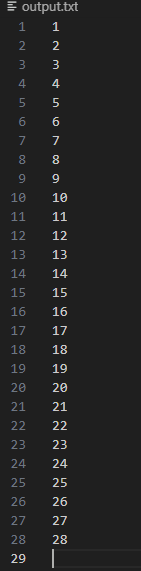

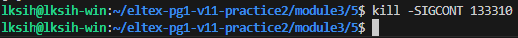