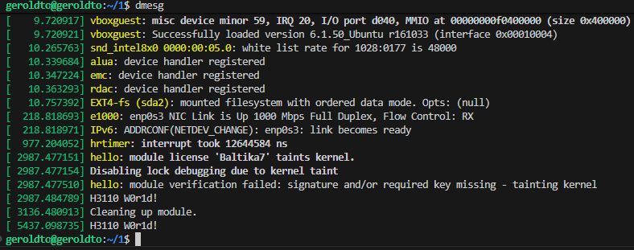
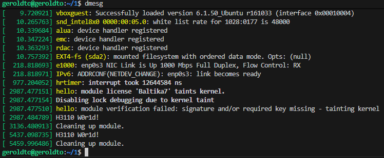

**Сборка:**

```bash
make
```

**Добавление модуля в ядро:**

```bash
sudo insmod hello.ko
```

**Результат вставки модуля в ядро:**

```bash
dmesg
```



**Удаление модуля из ядра:**

```bash
sudo rmmod hello.ko
```

**Результат удаления модуля из ядра:**

```bash
dmesg
```

