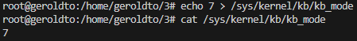
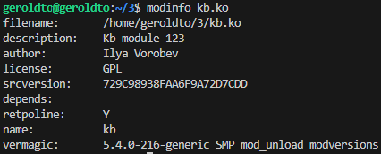

**Сборка:**

```bash
make
```

**Добавление модуля в ядро:**

```bash
sudo insmod kb.ko
```

**Удаление модуля из ядра:**

```bash
sudo rmmod kb.ko
```

**Запись в файл (через `sudo su`):**

```bash
echo число > /sys/kernel/kb/kb_mode
```

**Чтение файла:**

```bash
cat /sys/kernel/kb/kb_mode
```



**Информация о модуле:**

```bash
modinfo kb.ko
```



**Удаление модуля:**

```bash
make clean
```