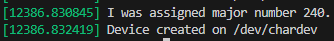
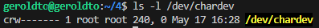
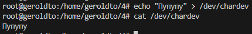
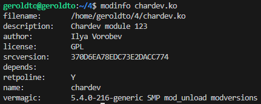

**Сборка:**

```bash
make
```

**Добавление модуля в ядро:**

```bash
sudo insmod chardev.ko
```




**Удаление модуля из ядра:**

```bash
sudo rmmod chardev.ko
```

**Запись в файл (через `sudo su`):**

```bash
echo текст > /dev/chardev
```

**Чтение файла:**

```bash
cat /dev/chardev
```



**Информация о модуле:**

```bash
modinfo chardev.ko
```



**Удаление модуля:**

```bash
make clean
```